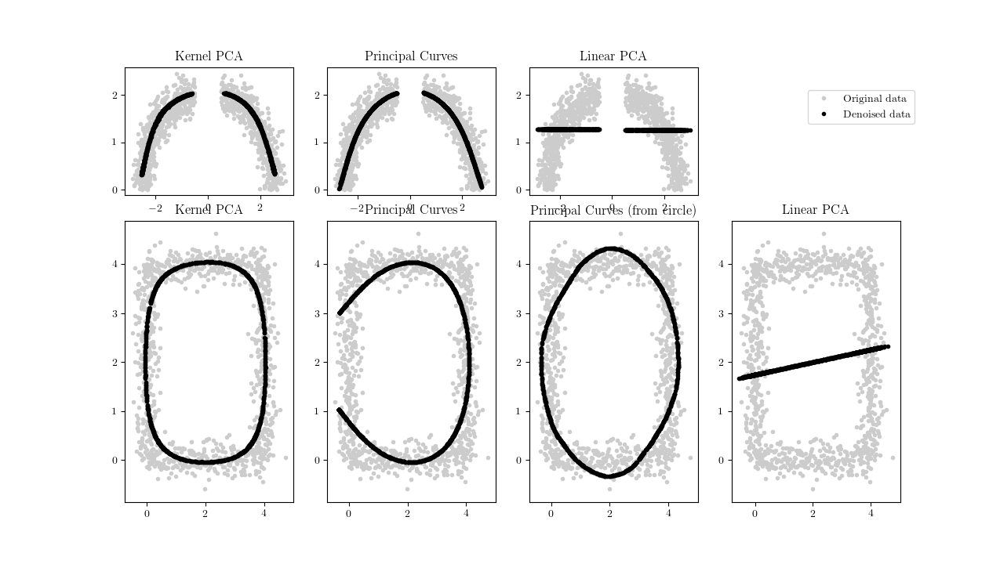

# Kernel PCA for denoising
Project in [DD2434 Machine Learning Advance Course](http://www.kth.se/student/kurser/kurs/DD2434?l=en), Winter 2016.

## Our team

| Name                 | GitHub                                            |
|----------------------|---------------------------------------------------|
| Federico Baldassarre | [baldassarreFe](https://github.com/baldassarreFe) |
| Zacharie Brodard     | [zach-b](https://github.com/zach-b)               |
| Alfredo Fanghella    | [alfredojf](https://github.com/alfredojf)         |
| Lucas Rodés          | [lucasrodes](https://github.com/lucasrodes)       |

## Our work
We reproduced the experiments presented in the paper [Kernel PCA and De-noising in Feature Spaces](docs/paper.pdf) by Sebastian Mika, Bernhard Schölkopf, Alex Smola Klaus-Robert Müller, Matthias Scholz and Gunnar Rätsch. In this regard, you can read our [report](docs/report.pdf) and our [presentation](docs/presentation.pdf).


## Dependencies

In order to run the experiments, make sure you have all dependencies installed

* matplotlib (>= 2.0.0)
* pandas (>=0.19.2)
* rpy2 (>=2.8.5)
* scikit-image (>=0.12.3)
* scipy (>=0.19.0)
* numpy (>=1.12.1)
* sklearn (>=0.0)

You can install them by typing
```
pip3 install -r requirements.txt
```

We strongly recommend using a [virtual environment](http://docs.python-guide.org/en/latest/dev/virtualenvs/) in order to keep these dependencies isolated from the rest of the system. Follow the instructions [here](files/setupvenv.md) to set up you virtual environment.

## Running the experiments

In the paper, there are three major experiments:

* Toy example: 11 Gaussians
* Toy example: De-noising
* Digit denoising (USPS Dataset)

The file [our_kpca.py](our_kpca.py) contains our own implementation of the kPCA method, based on the paper approach.

### Toy example: 11 Gaussians
The code related to this example can be found in [example1.py](example1.py).

Run the script as
```
python3 example1.py
```

By default, this script outputs the kPCA MSE, PCA MSE and their ratio for 45 different settings of sigma.

### Toy example: De-noising
The code related to this example can be found in [example2.py](example2.py)

Run the script as
```
python3 example2.py
```

Once the execution has ended, a picture as follows will be displayed.



You might get some warnings, just ignore them.

### Digit denoising (USPS Dataset)

> :warning:
  Known issue: the USPS dataset is no longer available at [mldata.org](mldata.org), we will look into an alternative source

The code related to this example can be found in [example3.py](example3.py)

Run the script as
```
python3 example3.py
```


